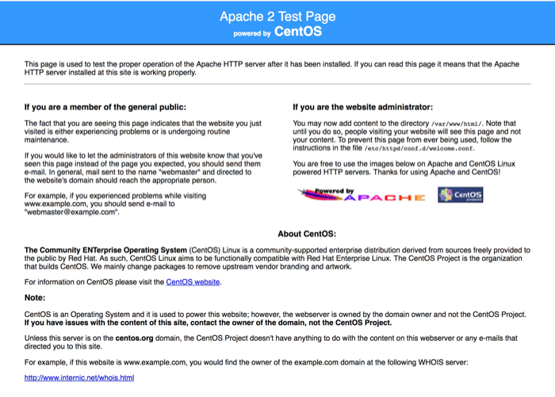

# Loft Core: Users

## Summary

This module adds some extra user-related features to Drupal core.

A big purpose of this module is to track anonymous users that appear "spammy" in order to block them from using your site.  It leverages the popular [Honeypot](https://www.drupal.org/project/honeypot) module to flag a potential spammy user.  It uses the [User restrictions](https://www.drupal.org/project/user_restrictions) module to then block the users, or generates a snippet of Apache code that can be pasted in the _.htaccess_ file to [block by IP address](http://www.htaccess-guide.com/deny-visitors-by-ip-address/).

Expanding upon core's ability to block or unblock a user in a binary fashion, this module brings additional context to a blocked user, so you have an idea _why_ the user was blocked.  Contexts include: user was _robo-trapped_, user is _honeybear_, user was marked _spammy manually_, user was manually converted from _honeybear to spammy_.

This module has a setting to record the IPs for **authenticated** users when they register, which augments the information stored about a user by Drupal core.

It also provides a setting that affects the login form, which will save the username of a user when they login, to a cookie in their browser.  When they visit the login form later, their username in the form is filled in from the cookie. [Read more here](remember_users.md).

## How Are Users Flagged/Blocked?

### The Honepot Module Finds Them Suspicious

When the honeypot module traps a user, it passes that information on to Loft Core Users where they become a "honeybear".  This does not affect them yet, merely flags them as suspicious.  After review at _/admin/config/people/loft-core-users_, you can manually convert honeybears to spammy users with the following SQL against your database.

    UPDATE loft_core_users SET status = 34 where status = 3;
    
    
    
Once converted the will be blocked from using the site.
    
### The User Has Visited an URL They Shouldn't Have

If you see paths that are visited by obvious robots, you can register such paths in `hook_menu` or `hook_menu_alter` to use the page callback `loft_core_users_robotrap_page_callback()`.  This sets up a trap that will immediately mark a user with the status `LOFT_CORE_USERS_STATUS_ROBOT`; they become robo-trapped.  Study the code for usage.

### Programatically in Code

Simply mark a user as spammy using `loft_core_users_mark_user_spammy`.  This is the turn-key function to use.

Or for more control, set one of the following specific statuses on a user with `loft_core_users_set_user_status`.

* `LOFT_CORE_USERS_STATUS_ROBOT`
* `LOFT_CORE_USERS_STATUS_HONEYBEAR`
* `LOFT_CORE_USERS_STATUS_HONEYBEAR_MADE_SPAMMY`
* `LOFT_CORE_USERS_STATUS_SPAMMY`

## How are Anonymous User Tracked?

Authenticated users are considered unique by their Drupal user id.  

Anonymous users, however are considered unique, by this module, by looking at their email address domain + their IP address.

As an example, if the website received three requests from anonymous users filling out forms with the following information, this module will see them all as a single user.  This is because all email addresses in the list share the same domain and the IP is the same from all three.

| mail | IP |
|----------|----------|
| a@spammy.com | 172.1.1.1 |
| b@spammy.com | 172.1.1.1 |
| c@spammy.com | 172.1.1.1 |

But in this next set, three database records will be created because the IP is different for two and non-existent for one, despite having the same base domain.

| mail | IP |
|----------|----------|
| a@spammy.com | 172.1.1.1 |
| b@spammy.com | 172.1.1.2 |
| c@spammy.com | null |

Lastly, take note that if the IP is the same but the domain differs, then three records will be tracked:

| mail | IP |
|----------|----------|
| trouble@spammy.com | 172.1.1.1 |
| trouble@morespam.com | 172.1.1.1 |
| trouble@totalspam.com | 172.1.1.1 |

## What Exactly Does Blocked Mean?

If you have enabled the [User Restrictions](https://www.drupal.org/project/user_restrictions) module, it will leverage the domain data collected by this module to block any user who is filling out the login form, the user regsitration form, or the user profile form, and whose email domain appears in the `loft_core_users` table as spammy. (Remember honeybears are not blocked yet).

If you have enabled the setting to automatically ban by IP, then new users will be locked out of your site at the Drupal level when their IP is associated with more than N spammy domains, where N is another module setting.  You may review and remove the ips banned in this way at _/admin/config/people/ip-blocking_.

## Apache Level Blocking

You may routinely visit _/admin/config/people/loft-core-users_ and export the apache snippet found there and paste it into your web root's _.htaccess_ file.  This will block IPs at the apache level and reduce the load on your server and Drupal.

The admin form always contains all IP address in the database so you can just replace the entire code in _.htaccess_ with the new snippet.

On that same form, you are asked how many spammy domains must share a single IP before they are included in the Apache list.  The logic is that if you see more than, say three domains, which have been marked as spammy coming from a single IP, you are probably safe to ban them from your site at the Apache level.

If you were to set this too low, you run this risk blocking valid users from ever accessing your site, or receiving assistence if wrongly blocked.  When a user is blocked by Drupal, they will see a link to the contact page where they can make a request to be unblocked.  But when they are blocked by apache, they have no way to contact you via website, as your site will never load for them.  They will see something like this:

## Suggested Modules to Use

### [Honeypot](https://www.drupal.org/project/honeypot)

Honeypot rejections will be tracked as "honey bears" and can later be converted to "spammy" users.  This only works if the `$_POST` array contains the key `mail`.  An example is `user_register_form`, where this works nicely.  Honeybears can be found in the table `loft_core_users` with a status of `LOFT_CORE_USERS_STATUS_HONEYBEAR`.  Unless they are converted to spammy users `LOFT_CORE_USERS_STATUS_HONEYBEAR_MADE_SPAMMY`, they are not blocked from using your site.

### [User Restrictions](https://www.drupal.org/project/user_restrictions)

This module is not a dependecy, but without it blocking a user doesn't have any real effect.

Blocks users with an email address containing any domains that have been found as "spammy".  The list of domains are found in `loft_core_users`.

### Contact Module

When a user is banned by drupal we will link them to the contact page, where they can ask to be unbanned.

## Todos

- [] batch process to mark all users that match domains or ips in our loft_users_core.
- [] vbo integration.
